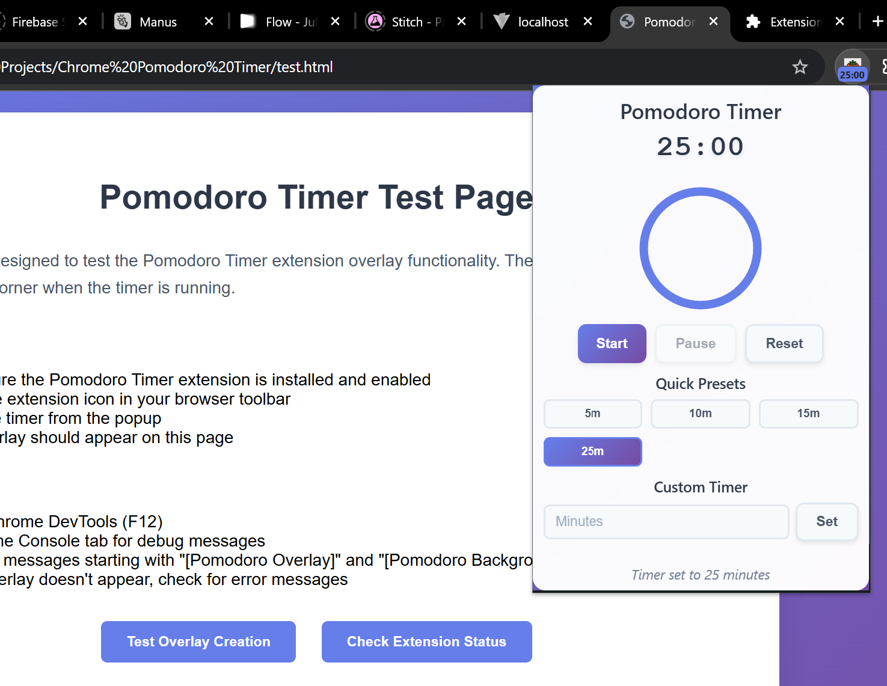
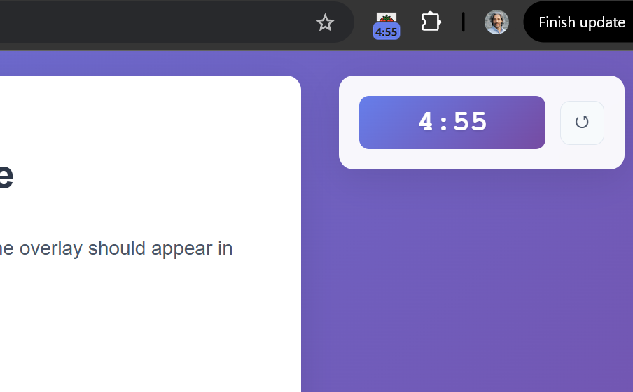

# Pomodoro Timer Chrome Extension

A modern, robust, and user-friendly Pomodoro timer for Chrome. Features a real-time countdown, a beautiful popup, and a sleek overlay that works across all tabs. Built for productivity, reliability, and a seamless user experience.

---

## Features

- **25-minute default timer** (customizable presets: 5m, 10m, 15m, 25m)
- **Start/Pause/Reset** controls in both popup and overlay
- **Real-time countdown** across popup, overlay, and extension badge
- **Overlay appears on all tabs** (even pre-loaded and new tabs)
- **State persistence** across browser sessions
- **Completion notifications** with sound alerts
- **Progress ring visualization** in popup
- **Custom timer input**
- **Visual feedback** (reduced opacity when paused)
- **Universal reset icon** (↺) for overlay reset
- **Automatic content script injection** for overlays
- **Clean, maintainable code** with robust error handling

---

## Screenshots

---

## Installation

1. **Clone or download** this repository.
2. Go to `chrome://extensions/` in Chrome.
3. Enable **Developer mode** (top right).
4. Click **Load unpacked** and select the project folder.
5. Pin the extension for easy access.

---

## Usage

- **Start the timer** from the popup or overlay.
- **Pause/Resume** by clicking the timer in the overlay or using the popup controls.
- **Reset** using the reset button in the popup or the ↺ icon in the overlay.
- **Overlay** will appear on all tabs when the timer is running (no need to refresh).
- **Overlay reset** will reset the timer, close the overlay, and open the popup for further adjustments.

---

## Development Chronology & Major Issues

### 1. Foundation
- Built manifest, background script, popup, and basic timer logic.

### 2. Overlay System
- Created content script for overlays.
- Implemented real-time updates and message passing.

### 3. Critical Bug Fixes
- **Timer jumping issue**: Fixed by removing conflicting storage checks.
- **Async response errors**: Standardized message handler responses.
- **Overlay visibility**: Fixed CSS and content script injection.
- **Content script duplication**: Added global flag to prevent re-initialization.

### 4. Advanced Features
- **Dynamic content script injection** for overlays on pre-loaded and new tabs.
- **State synchronization** across all UI components.

### 5. UI Simplification & Aesthetics
- Simplified overlay to a clickable timer and reset icon.
- Removed redundant force reset button.
- Added visual feedback for paused state (reduced opacity).
- Switched to a universal reset icon (↺) for clarity and reliability.

---

## Technical Design Choices

- **Background-centric architecture**: Single source of truth for timer state.
- **Fire-and-forget async**: Timer logic is never blocked by overlay updates.
- **Comprehensive error handling**: Try-catch around all Chrome API calls.
- **Debugging**: Extensive logging during development (can be toggled).
- **No redundant code**: Cleaned up all legacy and duplicate logic.

---

## Known Limitations

- Overlay may not appear on some special Chrome pages (e.g., chrome://, chrome-extension://).
- Overlay uses emoji for reset icon for maximum compatibility.

---

## Contributing

Pull requests and suggestions are welcome! Please open an issue or submit a PR for improvements or bug fixes.

---

## License

MIT License

---

## Credits

Built collaboratively with iterative design, robust debugging, and a focus on user experience and code quality. 